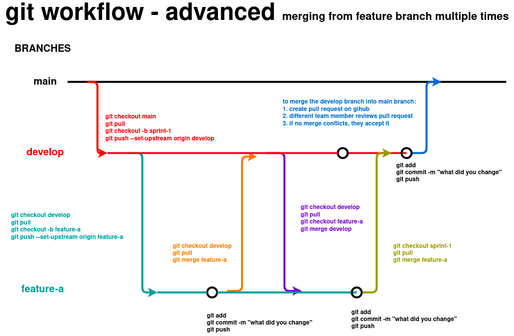

# Git Branching and Git Flow
## Branches
A **branch** is a sandbox, cloistered off because it isn't ready to be merged into the main line of
development yet.

**HEAD** is git's term for the commit that git is looking at right now. Almost all the time, HEAD is the most
recent commit on the branch you're looking at.
- `git checkout -b foo` - create a new branch called `foo`.
- `git checkout foo` - Point the `HEAD` to previously existing branch `foo`. You need to do this in order to make changes to branch `foo`.
- `git diff my_ref1 my_ref2` - Compares two references to each other and outputs the differences. If you don't specify myref2, it's assumed to be HEAD. For example, git diff my_other_branch compares the current HEAD against my_other_branch.
- `git branch -d foo` - Delete the branch. If the branch has unmerged changes it will fail.
- `git branch -m foo` will rename the branch.
- `git merge foo` merges branch foo into the current branch.
- `git reset 123f8a6` - Reset your HEAD and changed files to match the commit whose name starts with `123f8a6` . Usually this is used with the `--hard` flag to force removal of all uncommitted changes, e.g. `git reset --hard HEAD`  
  For more on git branching, see: http://ddc-web-curriculum.cnm.edu/intro-to-git/

## Git Flow

Branching allows us to create complex workflows to manage our software releases. One of the most popular is called Git Flow.
### Basic principles
- Don't develop on the master branch. **EVER**. Instead, merge other branches into it when they're production-ready.
- There's a **develop branch** that serves as the basis for almost all new code
- New code should be developed on **feature branches** that are branched off from development.
- Feature branches should be small and self-contained. Frequently, this means one per ticket.
- When feature branches are ready, they're merged into the development branch.
- When the feature branch is stable, these are merged into **release branches**.
- If you really, desperately need to create a fix to production outside the normal release workflow,
  you use **hotfix branches**. Don't do this unless it absolutely can't be avoided.
  https://www.atlassian.com/git/tutorials/comparing-workflows/gitflow-workflow

### Real world-examples
- In the wider world, many companies will use sprint branches as their development branch, and then create a release for every sprint.
- Git pull requests in the open source world follow the same basic model.

## What this means for you
All work on capstones should follow the git flow model.
- When starting a new ticket, create a branch for that ticket that is based on **develop**.
    - `git checkout develop`
    - `git checkout -b my-ticket`
- Then, do your work, adding, committing, and pushing frequently
    - `git checkout my-ticket`
    - do some work
    - `git add my-file.txt`
    - `git commit -m "Adding some really cool code"`
    - `git pull`
    - `git push`
        - the first time you do this it will fail, and you will have to run `git push --set-upstream origin my-ticket` before trying again
- When your work is complete for a given ticket, merge it back into develop and push it to github
    - `git checkout develop`
    - `git pull`
    - `git merge my-ticket`
    - `git pull`
        - probably not necessary since we just did this, but you can always pull, and better safe than sorry
    - `git push`
- When a sprint is complete, create a release branch, merge it into master, push it, and merge your release branch back into develop
    - `git checkout develop`
    - `git pull`
    - `git checkout -b my-release`
    - test your release branch here and commit
    - `git checkout master`
    - `git pull`
    - `git merge my-release`
    - `git pull`
    - `git push`
    - `git checkout develop`
- **Golden rules of git**
    - You can always pull from a remote branch to the corresponding local branch, e.g. `git checkout develop` then `git pull`
    - You can always merge from a higher branch in the hierarchy to a lower one, e.g. master -> develop or develop -> my-feature

## Further reading

- https://xkcd.com/1597/
- What to do if it goes all wrong: https://ohshitgit.com/
- git cheat sheet: https://github.github.com/training-kit/downloads/github-git-cheat-sheet.pdf
- git branching browser game: https://learngitbranching.js.org/